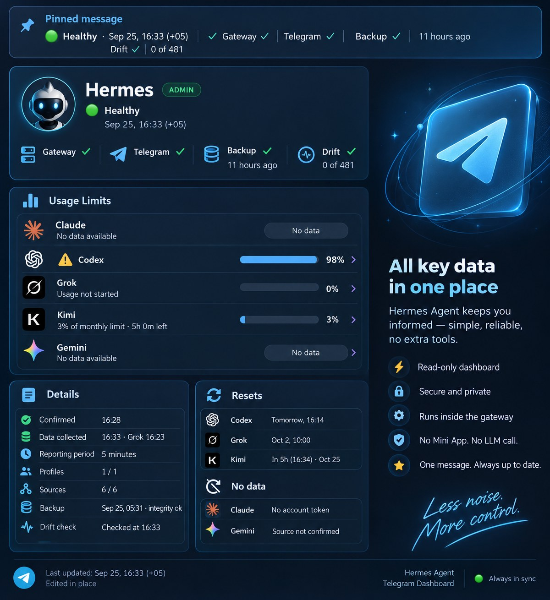

# hermes-agent-telegram-dashboard

[](https://github.com/bablobanov/hermes-agent-telegram-dashboard/actions/workflows/ci.yml)


Read-only status dashboard for [Hermes Agent](https://github.com/NousResearch/hermes-agent) as one
pinned Telegram message, edited in place on a schedule. No Mini App, no LLM call.

The updater lives **inside the gateway as a plugin** (`plugin/`): the bot token never leaves the
engine, the message is edited through the engine's own Telegram adapter. A cron tick with a
separate bot (`python -m telegram_dashboard`) remains as the fallback for installations without
the plugin API.

## Install

The plugin folder `plugin/telegram_dashboard_probe/` is self-contained: the `telegram_dashboard`
package lives inside it (module paths below, like `telegram_dashboard/grok.py`, are relative to
that folder). One line puts it into the gateway's plugin directory:

```bash
git clone https://github.com/bablobanov/hermes-agent-telegram-dashboard.git && cd hermes-agent-telegram-dashboard && install -d "${HERMES_HOME:-$HOME/.hermes}/plugins" && cp -r plugin/telegram_dashboard_probe "${HERMES_HOME:-$HOME/.hermes}/plugins/"
```

Then enable it in `config.yaml` (`plugins.enabled`, the `chat_id` setting; the table under
"Deploying on a gateway" below), restart the gateway, pin the message it sends. Nothing is
installed into the engine's environment; `SHA256SUMS` in the repository root lists every file of
the plugin folder, so `sha256sum -c SHA256SUMS` run from `plugin/` (or from the gateway's
`plugins/` directory) verifies a copy.

## What the message shows

One phone screen, about thirty characters per line, then a details block that Telegram shows
collapsed:

```
🟢 Healthy · Sep 25 12:21 +05       status and the dated data stamp (the pinned header shows it)
Gateway ✓ · Telegram ✓              words when something is off: stopped, disconnected
Backup ✓ 6 h ago                    the last state.db backup; ⚠️ when it failed or is older than 26 h
Drift ✓ 0 of 481                    keys that differ from the approved baseline

🧠 Limits used
Claude · no data                    a line without a number never shows a zero
⚠️ Codex 98% (1h21m)                the spent share, the time to the reset; the mark from 90%
Grok · usage not started            a state in words is never turned into a number
Kimi 3% (29d)                       every window, in the provider's own order
Gemini · no data

🤖 Hermes 0.21.3 → 0.21.5           the version the gateway runs → the latest upstream release

▎Details                            collapsed: confirmation time, the odd data minute, period,
▎…                                  coverage, absolute backup time and integrity, drift check
                                    time, release dates, the reason of every "no data"
```

The dashboard is one pinned text message in the agent's private chat or in a topic of its
group. The plugin inside the gateway edits it in place every few minutes through the engine's
own Telegram adapter, so the pinned-message bar at the top of the chat always shows the current
status line, and the message under it carries the rest: gateway and Telegram state, the last
backup, config drift, the account limits of every provider with the time to each reset, the
Hermes version the gateway runs next to the latest upstream release, and a collapsed details
block with the reasons and the timestamps. Nothing to open, nothing to install
on the reader's side, no second bot, no LLM call: it is there every time the chat is opened.



The picture is an illustration of what the message carries; the message itself is the plain
text above.

Up to five events that need attention come right after the top block, before the limits.
Account limits: Claude and Codex from the Hermes usage facade, Grok's weekly pool from the
surface xAI serves its own Grok CLI, Kimi Code's windows from the surface the Kimi Code platform
serves its own clients (see "Limits" below); Gemini is shown as "no confirmed source", never as
zero. Nothing is dropped from the old screen, only moved: a line without a number still names its
reason, in the details.

A source that cannot prove a value says `unknown`. A source that does not exist on this
installation says `unsupported`. Both lower coverage; neither turns green. Coverage itself
(`Profiles 1/1 · sources 6/6`) lives in the details and comes up to the screen only when it is
incomplete (`Profile coverage 2/3`, `Not observed: …`, `Stale: …`).

## Freshness is a load-bearing requirement

A pinned dashboard with a dead updater looks exactly like a calm system. Therefore:

- the message always carries the absolute data time and the last Telegram confirmation time
- a message not confirmed for two periods gets a loud banner on its first line; a confirmation
  within one period plus a little slack (`min(60 s, period/2)`, timer jitter of an updater that
  reads its own record one period later) still counts as confirmed
- `python -m telegram_dashboard --config c.json --check` reports message freshness with exit code
  0 (confirmed), 1 (lagging), 2 (stale, lost, never) for an external watchdog. A confirmation
  time ahead of the clock by more than a minute is `stale`, not "very fresh"
- the check reads the record of whichever path delivers: `plugin_state_path` for the plugin
  (the engine's `plugin-data/<namespace>/state.json`), otherwise `state_path` of the cron tick.
  The two paths never write the same file, and a check pointed at the wrong one says `never`

`message is not modified` from Telegram is treated as a confirmation, not a failure. A missing
message is logged at ERROR, recorded, recreated once, and announced in the new message.

## Compatibility across Hermes versions

The dashboard probes capabilities, never version numbers. The version line shows a number and
decides nothing by it (see "The Hermes version line"). `telegram_dashboard/compat_matrix.json`
records per source how it is probed and on which versions it was verified. A new release lowers
coverage and names what is missing instead of breaking.

What "verified" means here, honestly:

| Hermes | How |
|---|---|
| 0.21.1 (`2237be3559`) | the plugin path executed against the real engine objects (`tests/test_probe_plugin.py`) and a continuous pilot on a live gateway since 2026-09-11 |
| 0.21.3 (`v2026.9.14`) | the pilot gateway after its update; the Kimi credential resolver, registry row and the adapter's `_edit_text` read in the engine source; the plugin edits the pinned message as HTML through `_edit_text` on that gateway since 2026-09-25 (`screen_format: html` in its record, no fallback to plain taken) |
| 0.21.5 (`v2026.9.24`) | `_edit_text` read in the engine source: same signature and body as 0.21.1 and 0.21.3 |
| 0.20.5 | read in the source of a desktop install: the sources degrade, the plugin API is absent (see the floor below) |

Anything else is not verified. Above these versions the sources are probed at runtime and
degrade to `unsupported`; nothing here promises "works on all versions".

**Delivery has a floor: Hermes 0.21.1.** The plugin path needs
`PluginContext.register_platform_handler` and the adapters' `_wire_plugin_handlers`, and both
are absent in 0.20.x (checked on a 0.20.5 install: not present anywhere in the tree; `spawn_task`
and `PluginState` exist there but nothing would ever call the factory). On 0.20.x the plugin
does not load a handler and nothing is delivered; the only path there is the fallback cron tick
with its own bot token. The compatibility principle still holds for the *sources* (gateway
state, limits, drift degrade per version); it does not extend to delivery, and this README
does not promise otherwise.

Three prohibitions, learned from a predecessor that died of them: no imports of engine
**internals**, no replacement of core files, no post-merge hooks or `assume-unchanged`.

One named exception: account limits come from `agent.account_usage.fetch_account_usage`, a public
function with the same signature on every verified version, called exactly the way the gateway's
own `/usage` calls it (worker thread, deadline, failures never propagate; `limits.py`). An import
failure makes the source `unsupported`. The exception is a row in the matrix, not a habit.

## The plugin: the screen inside the gateway

`plugin/telegram_dashboard_probe/` is the plugin. Every tick it collects, renders the first screen
and edits the same message; the counter text of the vertical slice is gone.

```
register(ctx) → ctx.register_platform_handler("telegram", wire)
             → adapter.connect() calls wire(app, adapter)
             → ctx.spawn_task(tick loop)            (exactly once; reconnects do not add loops)
             → each tick: collect_all_async → render_dashboard → to_telegram_html and
               to_telegram_plain, then adapter = runner.adapters["telegram"] if connected,
               adapter.send(plain) once, adapter._edit_text(html, "HTML") afterwards,
               adapter.edit_message(plain) in the same tick when the HTML edit is refused
```

Two traps found by reading engine 0.21.1 and built into the plugin: `connect()` runs the factory
again on every reconnect with a new adapter instance, and `TelegramAdapter.edit_message` does not
forward to the replacement adapter (`send` does). A loop that keeps its first adapter would report
"Not connected" forever while looking alive. `tests/test_probe_plugin.py` executes the chain
against the real engine objects with the Telegram `Bot` mocked and simulates the reconnect.

**The screen is HTML when the adapter takes it, plain text otherwise.** The public
`edit_message` without `finalize` sets no parse mode (the engine builds its PTB application
without `Defaults`), and its `finalize=True` path converts to MarkdownV2 and, when the escaped
payload exceeds 4096 UTF-16 units, splits it into NEW continuation messages: a pinned dashboard
must never do that. The adapter's own `_edit_text(chat, id, text, parse_mode)`, the same on
0.21.1, 0.21.3 and 0.21.5, takes a parse mode and raises on refusal. Every tick calls it with
`HTML` (bold headings, the details in one `<blockquote expandable>`, both Bot API 7.4 features
that any bot may use) and, on any failure but "not modified", edits plain through the public verb
in the same tick. A plain edit that succeeds right after a failed HTML one means the form was
refused: the screen stays plain (upper-case headings, the details shown in full), the record says
`screen_format: plain` with the exception class in `html_error`, one warning goes to the journal,
and HTML is tried again twelve ticks later. An adapter without `_edit_text` gets the same plain
form and `html_error: no _edit_text`. The method is private: the plugin treats it as a
capability, never as a promise (`compat_matrix.json`, row `screen_html`). The one `send` that
creates the message (and a recreation after a loss) goes through the adapter's own markdown
conversion as plain text; the next tick edits it into the HTML form. The cron path sends the
HTML form with its own bot.

**A tick that cannot build the screen still edits the message.** Whatever fails while composing
(a collector, the render, the package import), the message gets a loud one-screen notice with
the exception class and the time, and the record carries `last_render_error`. Yesterday's text
on a pinned dashboard looks exactly like a calm system, which is the failure this project exists
to prevent. Inside the gateway the drift command and the usage facade run in worker threads with
deadlines (`collect_all_async`), so a slow provider never stalls the Telegram event loop.

Deploying on a gateway (0.21.x; 0.20.x has no `register_platform_handler`):

1. copy `plugin/telegram_dashboard_probe/` to `$HERMES_HOME/plugins/telegram_dashboard_probe/`,
   with the `telegram_dashboard/` package inside it as the repository keeps it. The engine loads a
   directory plugin as a package with `__path__`, so the package beside the plugin is imported as
   a relative package and nothing is installed into the engine's environment. A
   `telegram_dashboard` installed in the interpreter is the fallback; with neither the message
   says so instead of showing a screen
2. in `config.yaml`: add `telegram_dashboard_probe` to `plugins.enabled` and set
   `plugins.entries.telegram_dashboard_probe.settings`:

   | setting | env fallback | meaning |
   |---|---|---|
   | `chat_id` | `HERMES_DASHBOARD_PROBE_CHAT` | required; no chat, no handler |
   | `thread_id` | `HERMES_DASHBOARD_PROBE_THREAD` | forum topic; omit for General |
   | `period_seconds` | `HERMES_DASHBOARD_PROBE_PERIOD` | default 60; finite, clamped to [0.01, 86400]; while the Telegram adapter is not connected yet (right after a start) the next try comes in 30 s, not a period later |
   | `hermes_home` | `HERMES_HOME` | default `~/.hermes`; where `gateway_state.json` lives |
   | `drift_report` | `HERMES_DASHBOARD_PROBE_DRIFT_REPORT` | JSON with `checked_at`, `exit_code`, `stdout` |
   | `drift_command` | (config only, a list) | argv of `check_drift.py`; run off-loop on EVERY tick, 30 s limit, never two at once |
   | `limits_enabled` | `HERMES_DASHBOARD_PROBE_LIMITS` | default on; `0`/`false`/`no`/`off` turns it off |
   | `display_timezone` | `HERMES_DASHBOARD_PROBE_TZ` | IANA name; unknown degrades to UTC |
   | `limits_refresh_seconds` | `HERMES_DASHBOARD_PROBE_LIMITS_REFRESH` | default 900, floor 60; how often Grok and Kimi are asked (not every tick) |
   | `backup_status` | `HERMES_DASHBOARD_PROBE_BACKUP_STATUS` | JSON status of the last `state.db` backup (see "The backup line"); unset = the line says "not observed" |

   Neither drift source configured means drift is `unsupported` on the screen, never zero.
   The drift reader parses the output of our own `check_drift.py` (numbered sections
   `[N] …: count`, and the total from its `ключей N` line, `_KEYS_RE` in `collect.py`), which is
   not universal: another script with the sections but without that line gives no total and
   reads `Drift ✓ N keys`, and output without the sections reads `Drift: unknown` when the exit
   code says drift (exit 0 without them still reads as clean, `Drift ✓ 0 keys`).
   A source that hangs is not started again until its worker returns (one worker per
   source across ticks), so a stuck facade or command cannot fill the gateway's executor.
3. restart the gateway; the message appears in the configured chat and its screen moves

Use a chat you can sacrifice. The plugin writes its delivery record to the plugin state
(`$HERMES_HOME/plugin-data/<namespace>/state.json`, one key `probe`) so a gateway restart edits
the same message. The directory name carries a digest of the plugin id
(`agent-plugin-telegram_dashboard_probe-<8 hex>`); the plugin logs the exact path at start
(`probe: delivery record for --check plugin_state_path: ...`) at INFO, which a gateway that
journals WARNING and above never shows: take the path from disk
(`ls $HERMES_HOME/plugin-data/ | grep probe`). The plugin's observability rests on that state
file, not on the journal; an empty `grep probe:` in the journal means nothing.

The record also carries `limits_cache`, one entry per provider read on its own cadence
(`grok`, `kimi`), each with the last attempt (`attempted_at`) and its item, so the interval
survives a restart and the state file shows when the provider was last asked. A record from
before Kimi (Grok's attempt at the top level) is moved under `grok` once. Beside it,
`release_cache` holds the once-a-day check of the latest Hermes release the same way
(`attempted_at` and its item).

### The backup line

`Backup ✓ 6 h ago` sits in the top block, beside the gateway line, in every state: a screen
silent about the norm makes silence indistinguishable from confirmation. The absolute time and
the integrity verdict are in the details (`Backup Sep 24 05:31 · integrity ok`). The source is a
JSON status a backup job writes on every run (`ok`, `phase`, `reason`, `integrity`,
`finished_epoch` or `finished_at`); the dashboard reads that file only and never opens the
database or the copy. A failed run is loud on the line (`Backup ⚠️ failed 6 h ago`, the
`<phase>: <reason>` in the details) and an event; a status older than 26 h is marked
(`⚠️ older than 26 h`) and an event; a missing or unreadable file is `no data` with the reason in
the details and an event; no `backup_status` configured is `not observed`. The status shape is
the one our own timer writes (`state_db_publish.py` in the operator repository); any writer that
produces the same keys works.

### The Hermes version line

`🤖 Hermes 0.21.3 → 0.21.5` sits after the limits: the version the running gateway serves, then
the release upstream (`NousResearch/hermes-agent`) marks Latest. The same release reads
`🤖 Hermes 0.21.5 ✓`; no answer from upstream reads `🤖 Hermes 0.21.3 · no data`, with the reason
in the details. The details carry both release dates, how many releases lie between them and
when upstream was last checked (`Hermes 0.21.3 of Sep 14, latest 0.21.5 of Sep 24`,
`2 releases behind · checked Sep 25 16:40`).

The line informs, nothing more. Updating Hermes is a process, not a restart: the line carries no
mark, no threshold, no button, no command and no advice to update. Update by your own process.

- **The version** is `hermes_cli.__version__` of the module the gateway imported at start-up,
  looked up in `sys.modules`: a capability, not a version gate. Not the files on disk, not
  `importlib.metadata` (an editable install keeps the dist-info of install time), not the
  engine's `build_info.get_code_identity(refresh=True)` (inside the gateway it would restamp the
  gateway's own `code_sha`)
- **The latest release** comes from two unauthenticated GETs to `api.github.com`, at most once a
  day: `releases/latest` and `releases?per_page=100` (about 1 MB, the list carries every
  release's notes). The version is the one in the release name
  (`Hermes Agent v0.21.5 (v2026.9.24)`); releases behind are positions on upstream's list, never
  arithmetic on version numbers; drafts and pre-releases are not counted. The engine's own
  update check (`check_for_updates` in `hermes_cli/banner.py`) counts commits behind `main` and
  is not used
- **No LLM, no agent.** The request is plain stdlib `urllib`, made by the plugin itself in its
  own worker thread, under the same single-flight deadline (`Flights`, 25 s) and cache policy as
  Grok and Kimi. The agent, its sessions and its tools take no part. A GitHub that hangs costs
  this line its answer for the tick (`no answer within 25 s`) and nothing else: the gateway's
  event loop keeps running, the rest of the screen is collected as usual, and a hung request is
  not started a second time. `tests/test_hermes_version.py` pins all three
- **Once a day, failures too.** The attempt lives in the record under `release_cache` and
  survives a restart; a failed check (`GitHub rate limit`, `HTTP 503`,
  `request failed: URLError`, `answer shape: …`) is `no data` until the next attempt a day
  later, never a number. A reason never quotes the answer: GitHub's rate-limit message carries
  the caller's IP
- **Not a source.** The line moves neither the status nor the coverage, so a GitHub outage does
  not turn the screen ⚪. A crash of the collector itself is still an event, like any
  collector's
- The cron fallback tick (`python -m telegram_dashboard`) has no version line: it runs outside
  the gateway, where there is no gateway version to read, and keeps no durable cache

### Limits: three kinds that never mix

Every limit line is one of three things, and the caption says which: an **official quota**
(a number the provider itself reports, with its own reset date), **local accounting** (tokens
this installation counted; it never knows the remaining quota, nor spend outside the agent), or
**"no data" with a reason**. "Official" means *the number came from the provider*, not
*the surface is in the provider's docs*: the engine's own Anthropic and Codex fetchers read
undocumented surfaces (`api/oauth/usage`, the ChatGPT backend), and so does the Grok reader.
A documented surface would be preferable; an undocumented provider number is still the
provider's number, and a local count is not.

An official line is one line: `⚠️ Codex 98% (1h21m)`. Every window the provider reports is on
it, in the provider's own order, as `N% (time to reset)`: the spent share (every percent on the
screen is spent, never remaining, from every source; the heading says `🧠 Limits used`) and the
time to that window's reset in whole minutes rounded up (`45m`, `1h21m`, `24h`, `1d5h`), whole
days from two days on (`4d`), `(?)` when the reset date cannot be read. The mark comes from 90%
spent in any window. A window carries no length label: the share and its reset are what the
reader acts on, the owner of the account knows the plan, and a length the source does not state
would be a guess (the engine names Codex's windows `Session` and `Weekly` by position, and on
some plans the first one is the week). A limit for one model keeps its scope
(`Claude 37% (3h) · 12% (4d) · Opus 5% (4d)`). A state the provider reports in words is never
turned into a number or a zero (`Grok · usage not started`).
There is no bar: Telegram draws the block glyphs from a fallback font, and a bar by fifths says
less than the number after it; Telegram has no text colour either, so the mark is the only
emphasis. The countdown counts from the data time on the first line: a message that stopped
updating is the freshness banner's business, not the countdown's. A number read on its own
cadence must not borrow the screen's stamp: the details line `Data 12:21 · Kimi 12:16` names
every number read at another minute than the screen, and a cached number is never shown older
than its refresh interval (`quota_cache.py`), after two intervals the source is `Stale` on the
screen. A stale number under a fresh stamp looks like knowledge, which is the one thing a limits
block must never do.

**Grok** (`telegram_dashboard/grok.py`): the weekly pool of the SuperGrok subscription, read
from `https://cli-chat-proxy.grok.com/v1/billing?format=credits` with the token the engine
already holds for `xai-oauth`, obtained through the engine's own resolver
(`hermes_cli.auth_xai.resolve_xai_oauth_runtime_credentials`, so the screen shows the quota
of exactly the grant inference uses) and the client header the Grok CLI sends. The plan name
comes from `…/v1/settings` (`subscription_tier_display`), optional, and rides on the item
(`plan`, not shown on the screen yet). Probed on 2026-09-12: the
inference host `api.x.ai` answers 404 for this path, so the proxy host is required. Policy:
one attempt per `limits_refresh_seconds`, success or failure; a failed attempt is "no data"
with its reason until the next interval; a cached number older than the interval is not shown.
The shape is checked strictly (`currentPeriod.type == USAGE_PERIOD_TYPE_WEEKLY`, a finite
percent in 0..100, a readable end date); anything else is named, not guessed. One answer is a
state rather than a changed shape: right after the weekly reset the proxy leaves
`creditUsagePercent` out altogether until the first request of the new period (probed
2026-09-25). The line then reads `Grok · usage not started`, never a zero, and only while the
period is the current one and on-demand spend is an explicit zero; a percent missing under any
other conditions is named (`no creditUsagePercent`). Grok is its own source on the coverage
line (`Grok quota`).

**Kimi** (`telegram_dashboard/kimi.py`): the windows of the Kimi Code subscription, read from
`<base URL>/v1/usages` on the very host the engine uses for Kimi inference. The key and the base
URL come from the engine's own resolver
(`hermes_cli.auth.resolve_api_key_provider_credentials("kimi-coding")`: `.env` first, then the
credential pool, then the key-prefix redirect), so the screen shows the quota of exactly the
credential inference uses, and the request carries the client header the engine sends to that
host. The shape is the one the official client parses (`@moonshot-ai/kimi-code-oauth`,
`managed-usage.ts`): `usages.limit_7d` (legacy plans) and `usages.limit_month_total` (new
plans), each with `used_ratio` in 0..1 and a `reset_time`, every window on the line with its own
reset (`Kimi 3% (29d)`). `usages.limit_5h` is not shown for now: on the pilot account it has read
0 at every reading while `limits[]` beside it reported 55 of 100 for a 300-minute window with the
same reset, and the plan shows no five-hour limit; a probe decides what either field is. Same
policy and cache as Grok; the request never goes through the credential pool's rotation, so a
failed request cannot mark the pool exhausted. Not in Kimi's docs; a changed shape is named,
not guessed. Kimi is its own source on the coverage line (`Kimi quota`).

**Claude on an installation without an Anthropic credential**: the line says `no data` and the
details say `no account token`, a reason, never a zero.

The check for the plugin path is the same `--check`, pointed at that file:

```json
{ "plugin_state_path": "~/.hermes/plugin-data/<namespace>/state.json", "period_seconds": 300 }
```

`period_seconds` here is the tolerance the check grants, not the plugin's period: with the
plugin editing every 60 s, 300 means five missed ticks before the first alert (`confirmed` up to
one period plus slack, `lagging` up to two, `stale` past that). The record also carries
`tick_failed` when a tick raised, so a loop that dies every tick does not keep an old `edited`
on disk.

### The watchdog: `watchdog/dashboard_probe_check.py`

A dead plugin cannot edit the message to say it is dead, so the check must run outside the
plugin. `watchdog/dashboard_probe_check.py` is that check in the shape of a Hermes cron job with
`--no-agent --script`: the scheduler runs it as `python <path>` from `$HERMES_HOME/scripts/`
(scripts are accepted from nowhere else), delivers whatever it prints, and treats empty stdout
as silence. Cron passes no arguments, so the config is `dashboard_probe_check.json` next to the
script (`plugin_state_path`, `period_seconds`, `check_interval_seconds`; a path as the first
argument serves manual runs, `--verbose` prints the state line even when silent).

```bash
hermes cron create "*/5 * * * *" --name dashboard-probe-check --no-agent   --script dashboard_probe_check.py --deliver telegram:<chat_id>:<alert_topic>
```

Repeat policy, and why: the durable state lives in the message itself, whose freshness stamp is
what the dashboard is for; an alert is an interruption, not an indicator, and twelve an hour
teach the reader to stop reading the watchdog. So `confirmed` is silence; `lagging` and `stale`
speak on the first tick past the confirmation threshold and then once an hour; `never` and
`lost` speak every tick, because there is no message to carry the state and silence there would
be indistinguishable from health. The repeat is stateless (counted from the confirmation stamp,
the watchdog stays read-only) and its hourly window is exactly one tick wide, so a tick the
scheduler skipped swallows that hour's alert; the next hour speaks again. Exit code is 0 in
every judged state; non-zero only when the watchdog itself is broken (config or package
missing), which the scheduler reports as a failed script.

Deployment ships a **cut** of the package next to the script, not the whole thing:
`telegram_dashboard/` with `__init__.py`, `schema.py`, `freshness.py`, `timeparse.py` only
(`PACKAGE_MODULES` in the script). `tests/test_watchdog_script.py` runs the script in a
subprocess with `-I` against a directory holding exactly that cut, so an import creeping past it
fails the test, not the server. The plugin and the cut are two artifacts of one commit; nothing
but their sha256 ties them together on the server, so check both at delivery.

Coverage boundary: the job runs inside the same gateway as the plugin and alerts through the
same channel. It covers "plugin dead, gateway alive" and **not** "gateway dead": there both are
silent, and that silence looks exactly like health. Acceptance therefore needs one real run from
the scheduler with the alert actually arriving (`hermes cron run` bypasses the scheduler's
dispatch), not only a manual run that prints.

## Running the fallback tick

The package runs from the plugin folder; point Python at it (or at a deployed copy):

```bash
export PYTHONPATH=plugin/telegram_dashboard_probe
python -m telegram_dashboard --demo 2                 # render static verification state 2
python -m telegram_dashboard --config c.json --dry-run
python -m telegram_dashboard --config c.json          # edit the pinned message
python -m telegram_dashboard --config c.json --check  # freshness of the message itself
```

Config is JSON. Every deployment-specific value (chat id, topic id, paths, token variable name)
lives there, not in code:

```json
{
  "hermes_home": "~/.hermes",
  "chat_id": "-1001234567890",
  "thread_id": "17585",
  "period_seconds": 300,
  "state_path": "~/.hermes/scripts/dashboard-delivery.json",
  "token_env": "HERMES_DASHBOARD_BOT_TOKEN",
  "drift_command": ["python3", "/path/to/check_drift.py"],
  "backup_status": "/path/to/daily-status.json",
  "display_timezone": "UTC",
  "limits_enabled": true,
  "recreate_on_loss": true
}
```

Limits are only available when the tick runs in an interpreter that can import the engine (the
gateway's own); elsewhere they degrade to `unsupported`.

## Tests

```bash
python -m pytest tests             # plus `pip install tzdata` on Windows
ruff check . && ruff format --check . && mypy --strict -p telegram_dashboard
```

`pyproject.toml` points pytest and mypy at the package inside the plugin folder. Every run prints
`telegram_dashboard.__file__` in the header: a green run that does not say which tree it tested
proves nothing. Run it without `-q`: pytest hides the header in quiet mode. No test reaches a provider: the Grok, Kimi and GitHub attempts are stubbed by an autouse
fixture in `tests/conftest.py` unless a test passes its own fake, and the running Hermes version
there is a fixed one; a plugin loaded by the test
helpers takes that same patched package, not a second copy of it under the plugin's name
(`tests/probe_fakes.py`, `load_plugin`). `tests/test_probe_plugin.py` skips unless the Hermes engine is
importable; to run it, use an interpreter with the engine and `python-telegram-bot` installed
(for example `uv sync --extra messaging` in an engine checkout with `UV_PROJECT_ENVIRONMENT`
pointing outside the checkout, then that venv's `python -m pytest tests/test_probe_plugin.py`).

## License

MIT.
